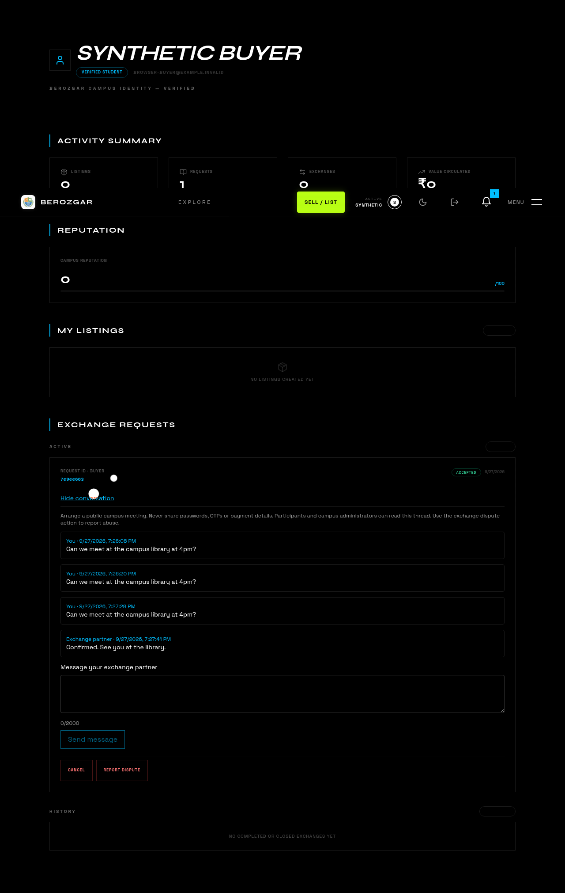

# APODEX continuation — exchange completion and trustworthy evidence

Date: 27 September 2026. Base: `3de258b`. Branch: `feat/apodex-exchange-evidence`.

## Scope and verdict

Implemented the next two research priorities: durable analytics and request-scoped conversations. Verified the actual current tree rather than repeating already-completed V3 work. This is a tested implementation increment, **not a certification that the whole product is production-ready**. No live deployment, pilot traction or 100x result is claimed.

Inputs: the supplied APODEX implementation report plus the ZIP's production plan and implementation-roadmap CSV. The original battle-plan documents mentioned by those files were not separately attached. The privacy correction in the plan is binding: no student directory ingestion, embeddings or model upload. No new third-party analytics/model processor was added.

## Shipped changes

1. **Private exchange thread:** authenticated `GET/POST /api/requests/:id/messages`, buyer/seller participation checks from the database, admin read-only review, restricted-user denial, verified-student writes, read-only terminal/disputed threads, plain-text sanitization, 2,000-character bound, 20 sends/minute, 50-row stable cursor pages, no-store responses. UI in Profile → Exchange Requests → Open conversation, visible safety guidance, accessible labels, loading/error/empty states, 15-second foreground polling, older messages, safe retry identities and double-submit protection. Unique `(request, sender, clientId)` plus row locking prevents concurrent retry duplication. Admin review is an API capability; no new admin conversation console was built.
2. **Durable, minimized evidence:** events are committed before 202; fixed event vocabulary; arbitrary properties, context, supplied user identity, URLs and error contents discarded. Client sends only event metadata and authenticates with its existing session token. CSRF-compatible keepalive fetch replaces sendBeacon (which cannot carry the CSRF header). Failures/429s requeue within the existing bounded buffer. This telemetry is best effort, not exactly-once.
3. **Admin evidence endpoint:** `GET /api/admin/analytics/funnel?days=7` (1–30 days) returns transactional database activity counts and separate untrusted client event counts. It explicitly does NOT claim sequential cohort conversion. Verified/completed counts reflect the current state of records created in the window. No fabricated pilot figures or latency percentiles.
4. **Retention:** raw analytics older than 30 days are pruned during scheduled recovery; account deletion unlinks analytics identity. This is a running-process cleanup, not a guaranteed independent scheduler. Conversations remain attached to their request for review; request/sender deletion cascades. Privacy text reflects visibility and retention.
5. **Critical discovered integration defect:** API normalizes enums to lowercase, but request UI/FSM expects uppercase. Query and mutation adapters now normalize request statuses. Previously an accepted exchange appeared in History without controls. Browser validation reproduced and verified this fix.
6. **Critical discovered race:** `findUnique` is not a row lock. Request FSM events now acquire an actual PostgreSQL `FOR UPDATE` lock, shared with message sends. Real concurrent cancellation test proves one successful transition and one reputation-counter increment.
7. **Migration/runtime repairs:** Prisma native UUID declarations now match existing SQL migrations. New migration adds messages/events and repairs missing OTP `attempts`, nullable system audit actor and `ON DELETE SET NULL`. All five migrations replayed successfully on an empty PostgreSQL 16.4 database. Existing data is not rewritten into different ID types.
8. **Production build:** backend now creates runnable CJS through explicitly pinned esbuild; `npm start` uses that artifact rather than unresolved TS aliases. Docker reuses this build and installs native dependency scripts. Frontend Docker build now copies the local shared package before `npm ci`.
9. **CI/provenance:** PostgreSQL integration job runs real migrations and tests. Deploy job is now gated on successful push CI, serialized, and pinned to the tested SHA instead of moving main. This is not a complete rewrite of the existing deployment pipeline.

## Validation evidence

| Check | Result |
|---|---|
| Baseline frontend suite | 536 passed |
| Baseline server suite | 100 passed |
| Updated frontend suite | 542 passed |
| Updated server unit/contract suite | 125 passed; optional DB suite skipped without its environment variable |
| PostgreSQL/Fastify integration | 7 passed separately with real PostgreSQL 16.4, CSRF enabled, real JWTs and no mocked persistence |
| Migration replay | All 5 migrations applied from zero using `prisma migrate deploy` |
| Frontend Vite production bundle | Passed |
| Backend typecheck + production bundle | Passed |
| Compiled production process | Started; `/health/ready` returned 200 on clean migrated DB |
| ESLint | Passed |
| Real Chromium exercise | Password login → profile → buyer send → independent seller login/read/reply → buyer reload/read persisted reply |
| Full frontend project typecheck | **FAIL: 687 existing errors remain**, predominantly legacy WebGL components. Initial baseline had 688 existing errors; fixed missing `CreateListingInput` import. No new feature-file type errors. Root `tsc --noEmit` script alone does not check the referenced app project adequately. |
| Public domain | Local DNS lookup failed for apex and www; not proof of registrar root cause |
| Live production, email/OAuth, restore drill, load testing | Not verified |

Browser evidence uses synthetic local accounts only:



The committed optional Playwright test `e2e/exchange-thread.spec.ts` supports dedicated staging account/request environment variables. The local two-participant exercise was a separate Playwright script against the real compiled API, real DB and frontend, not network mocking.

## Review council — explicit engineering perspectives, not claimed independent agents

No multi-agent execution facility was available. These are structured review lenses applied by this agent; install/build/test jobs ran in parallel, not independent AI agents.

- **Product:** completion is the wedge; messaging removes meeting coordination friction before adding AI.
- **Security/privacy:** server-derived identity, access checks per page/send, admin review without impersonation, no student directory retrieval, no raw analytics payload retention.
- **Reliability:** durable acceptance, retry uniqueness, transaction locks, fresh migration replay and executable production artifact beat another feature demo.
- **Measurement:** authoritative DB activity separated from spoofable client counts; report denominators/time windows; don't turn event count into impact.
- **Growth:** measure completed exchanges and successful meeting coordination before expanding campuses. Public read-only discovery remains next, with a deliberately narrow response DTO that excludes identity/contact fields.

## Premortem and decision gates

| Failure | Prevention now | Remaining gate |
|---|---|---|
| Messages leak to outsiders | DB-scoped membership, uniform missing/inaccessible response, no-store, tests | Review logs/backups and support access policy |
| Duplicate send / trust counter inflation | Stable retry UUID + unique constraint; actual FSM row lock | Multi-instance stress test and realistic traffic |
| Silent analytics loss / inflated impact | Commit before 202; explicit untrusted-event labeling | Alerting for ingestion/pruning failures; cohort analytics and dedup if needed |
| PII enters analytics or AI corpus | Fixed vocabulary; discard free-form metadata; no AI ingestion | Public corpus allow-list and directory access review before Q&A |
| Deploy from failed or different build | CI-success guard and tested-SHA pin | Repair legacy deployment details below; staging rehearsal |
| New host cannot start | Shared package copied, native dependencies installed, runnable bundle | Docker build on target architecture; restore/rollback drill |
| Conversation abuse | Verified participants, rate limit, dispute flow and read-only closed threads | Moderation SLA, reporting UX, explicit deletion/retention policy approval |
| Judge/user still sees dead site | No false live claims | DNS/hosting credentials, verified HTTPS and real user journey |

## Remaining work in priority order

1. Revoke/rotate the GitHub token exposed in the request and previous attached report. It was used only for authorized GitHub operations and is not embedded in repo URLs, files or this report.
2. Fix live DNS/hosting; inspect staging/production schema drift before migration. Production may have `db push` history. Back up and rehearse on a restored snapshot. Never run reset/seed against production.
3. Repair the remainder of the legacy deploy workflow: it still assumes a pulled registry image, migrates before building the new image, checks an API host port not exposed by compose, does not copy the downloaded frontend artifact to VPS, and its claimed rollback is unreliable. Do not enable unattended release until these are resolved or use the manual runbook.
4. Address 687 existing frontend TypeScript errors, then make `tsc -p tsconfig.app.json --noEmit` a required check. Do not hide them with `any`/ts-ignore.
5. Run real OAuth/email/signup/verification/password-reset flows, multi-device exchange completion/dispute/admin moderation, Docker startup and backup restore tests on staging. Review rate limiter storage for multi-replica deployments.
6. Add safe public read-only discovery; do not simply remove ProtectedRoute from pages whose API payloads include owner details.
7. Add retrieval-only campus Q&A over a reviewed public corpus. Explicitly exclude the student spreadsheet, identity tables, private exchanges and audit logs. Start with cited lexical search and query evaluation, not autonomous agents.
8. Run consented pilot. Pre-register metrics: active verified participants; approved listings; request-to-acceptance ratio; accepted-to-completed ratio; median time to first partner reply; unresolved dispute rate. Use server lifecycle evidence. No invented N or promised 100x traction.
9. Defer tenancy, paid provider placements and placement automation until campus completion/retention evidence justifies expansion. No escrow/payment claims.

## Safe manual staging deployment

Use a same-origin HTTPS frontend and `/api` reverse proxy. The cookie/CSRF model is not automatically portable to unrelated Vercel/Render origins.

```sh
# From reviewed release checkout; configure secrets out of band.
npm ci
npm run build
cd server
npm ci
npx prisma generate
npm run build
# DATABASE_URL points to staging/restored database; back it up first.
npx prisma migrate deploy
npm start
```

For existing VPS compose, build the API before migrating so the migration files are current:

```sh
# At repository root after frontend build; .env.production is permission-restricted.
docker compose -f docker-compose.prod.yml --env-file .env.production build api
docker compose -f docker-compose.prod.yml --env-file .env.production up -d postgres
docker compose -f docker-compose.prod.yml --env-file .env.production run --rm --no-deps api npx prisma migrate deploy
docker compose -f docker-compose.prod.yml --env-file .env.production up -d api nginx
docker compose -f docker-compose.prod.yml --env-file .env.production exec -T api wget -qO- http://localhost:3001/health/ready
```

Then verify external TLS, `/health/ready`, login and two-participant exchange. Preserve previous app image and frontend artifact; rollback application only while leaving additive tables intact. Do not drop messages/events to roll back code. Actual production secrets/DNS/backup procedures require the owner.
